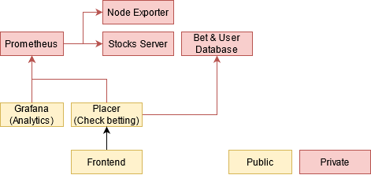

# Running the Demo
1. Install docker
2. Run docker compose up -d
3. Wait for everything to start and collect data
4. Visit localhost:3000 for analytics (Dashboards have been created automatically)
5. Visit localhost:1337 for the betting backend (unfortunately only available rudimentary)
6. Visit localhost:9090 for prometheus console
7. Visit localhost:8080 for current stock metrics

# Architecture

This image shows some components that have not yet been completed.
This repository contains the following projects:

## docker-compose.yml
Using docker compose the whole application can be started by using docker compose up.
Initially the application betting-runner will also be compiled. If the image exists already,
docker compose build needs to be executed beforehand.

## betting-runner
The betting runner is a java command line application providing the following commands.
Most of their documentation is also included through help commands:

- **server** -
  Exposes the metrics as an HTTP server and continuously run the data collection.
  Every collected data point is automatically stored and exposed through prometheus.

- **local** -
  Allows running defined data sources (see [here](.backend/runner/datasources)).
  This could be provided to users for creation of their own data sources.
  In particular see [user_supplied.ds.yml](.backend/runner/datasources/user_supplied.ds.yml)
  for a potential example.

- **stocks**  - 
  Example application providing real time stock exchange metrics using finnhub.io 
  or alternatively in offline mode randomly generated fluctuation.

- **placer**  - 
  Example betting Server. Contains *most* functionality.
  Unfortunately as of now, bets can neither be created by the application, 
  nor can the money be divided, due to a lack of time to finish the implementation.
  As such right now only the ability to gain tokens and spend them on existing bets (manually created) is possible. 
  Authentication should in the future also be provided. Most of the application could be
  verbatim copied into a serverless environment, so that scaling this service is not a problem.
  Money dividing is structured as a queue and as such would allow asynchronous processing without worrying about disruption of the existing operations.

The application can be built using maven (see [pom.xml](betting-runner/pom.xml)) or docker (see [Dockerfile](betting-runner/Dockerfile))
